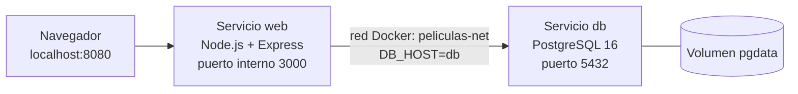

# Gestor de Películas – Equipo 5

Mini proyecto DevOps: aplicación web contenerizada con Docker y Docker Compose, con base de datos PostgreSQL.

## Integrantes

- Juan David Paz Trochez (GitHub: [GojoSatorouXD](https://github.com/GojoSatorouXD))
- Jose Luis Huila Obregón (GitHub: [Joseluis0221](https://github.com/Joseluis0221))

> Equipo conformado por 2 integrantes.

## Descripción

Aplicación web sencilla para gestionar películas. Permite **crear, consultar, modificar y eliminar** películas (título, director, género y año). Los datos se almacenan en PostgreSQL y persisten aunque se detengan los contenedores.

## Tecnologías utilizadas

- Node.js 20 + Express (servidor web)
- EJS (vistas HTML)
- PostgreSQL 16 (base de datos)
- Docker y Docker Compose
- Git y GitHub (ramas, Pull Requests)

## Arquitectura



- El navegador accede a la aplicación por el puerto **8080**, que Compose mapea al puerto **3000** del contenedor `web`.
- El servicio `web` se conecta a PostgreSQL usando el **nombre del servicio** (`db`) dentro de la red `peliculas-net`, nunca `localhost`.
- Los datos de PostgreSQL se guardan en el volumen `pgdata`.

## Estructura del proyecto

```
peliculas-devops/
├── src/
│   ├── server.js        # Servidor Express y rutas del CRUD
│   ├── db.js            # Conexión a PostgreSQL y creación de la tabla
│   └── views/
│       ├── index.ejs    # Listado de películas y formulario de creación
│       └── editar.ejs   # Formulario de edición
├── Dockerfile           # Imagen de la aplicación (node:20-alpine)
├── docker-compose.yml   # Servicios web y db, red, volumen y variables
├── .dockerignore        # Archivos excluidos de la imagen
├── package.json         # Dependencias de Node.js
└── README.md            # Documentación del proyecto
```

## Configuración

Las variables de entorno están definidas en `docker-compose.yml`. No hace falta crear ningún archivo adicional.

| Variable | Función | Valor por defecto |
|---|---|---|
| `DB_HOST` | Nombre del servidor de base de datos (nombre del servicio en Compose) | `db` |
| `DB_PORT` | Puerto de PostgreSQL | `5432` |
| `DB_NAME` | Nombre de la base de datos | `peliculas` |
| `DB_USER` | Usuario de la base de datos | `peliculas_user` |
| `DB_PASSWORD` | Contraseña del usuario | `peliculas_pass` |

El servicio `db` usa `POSTGRES_DB`, `POSTGRES_USER` y `POSTGRES_PASSWORD` con los mismos valores para crear la base de datos al iniciar.

## ¿Cómo ejecutar el proyecto?

**Requisitos:** tener instalados [Git](https://git-scm.com) y [Docker Desktop](https://www.docker.com/products/docker-desktop/) (incluye Docker Compose). No hace falta instalar Node.js ni PostgreSQL.

1. Abrir Docker Desktop y esperar a que indique **Engine running**.
2. Clonar el repositorio:
```bash
   git clone https://github.com/GojoSatorouXD/peliculas-devops.git
```
3. Entrar a la carpeta del proyecto:
```bash
   cd peliculas-devops
```
4. Construir e iniciar los servicios:
```bash
   docker compose up --build
```
5. Esperar a ver en la terminal el mensaje `App escuchando en puerto 3000`.
6. Abrir en el navegador: **http://localhost:8080**
7. Para detener los servicios (los datos se conservan):
```bash
   docker compose down
```

**Nota:** el puerto 8080 debe estar libre en el equipo.

### Comandos útiles para verificar

```bash
docker compose ps        # Estado de los contenedores web y db
docker network ls        # Red peliculas-devops_peliculas-net
docker volume ls         # Volumen peliculas-devops_pgdata
docker exec -it peliculas_db psql -U peliculas_user -d peliculas -c "SELECT * FROM peliculas;"
```

## Git y trabajo colaborativo

El trabajo se organizó con una rama por cada parte del proyecto, y cada una se integró a `main` mediante Pull Request revisado por el otro integrante:

| Rama | Contenido | Pull Request |
|---|---|---|
| `feature-aplicacion` | Servidor Express, vistas EJS y rutas CRUD | [PR #1](https://github.com/GojoSatorouXD/peliculas-devops/pull/1) |
| `feature-base-datos` | Conexión a PostgreSQL y creación de la tabla | [PR #2](https://github.com/GojoSatorouXD/peliculas-devops/pull/2) |
| `feature-docker` | Dockerfile y .dockerignore | [PR #3](https://github.com/GojoSatorouXD/peliculas-devops/pull/3) |
| `feature-compose` | docker-compose.yml (servicios, red, volumen, variables) | [PR #4](https://github.com/GojoSatorouXD/peliculas-devops/pull/4) |
| `feature-readme` | Documentación del proyecto | [PR #5](https://github.com/GojoSatorouXD/peliculas-devops/pull/5) |

Flujo utilizado: rama → commits → push → Pull Request → revisión (Approve) → merge a `main`.

## Persistencia

PostgreSQL usa un **volumen de Docker** llamado `pgdata`, montado en `/var/lib/postgresql/data` del contenedor `db`. Está declarado en `docker-compose.yml`:

```yaml
volumes:
  - pgdata:/var/lib/postgresql/data
```

**Cómo se comprobó:**
1. Se ejecutó `docker compose up` y se crearon películas desde http://localhost:8080.
2. Se ejecutó `docker compose down`, que elimina los contenedores y la red.
3. Se ejecutó `docker compose up` de nuevo.
4. Las películas registradas seguían disponibles, porque los datos viven en el volumen y no en el contenedor.

> Importante: `docker compose down -v` elimina también el volumen y borra los datos. Para conservarlos, usar solo `docker compose down`.